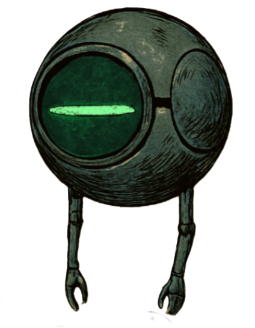
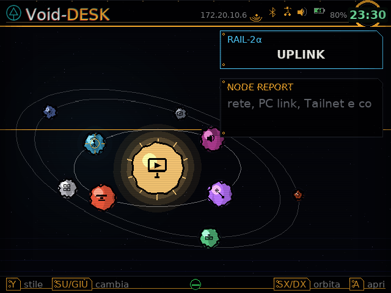
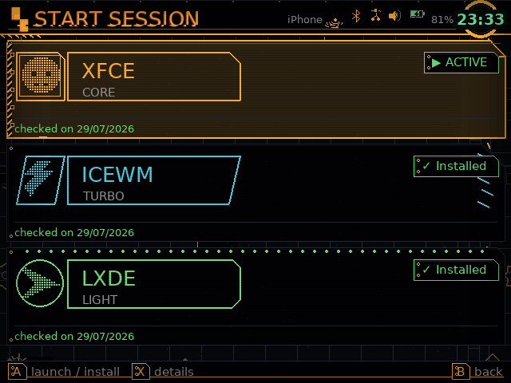
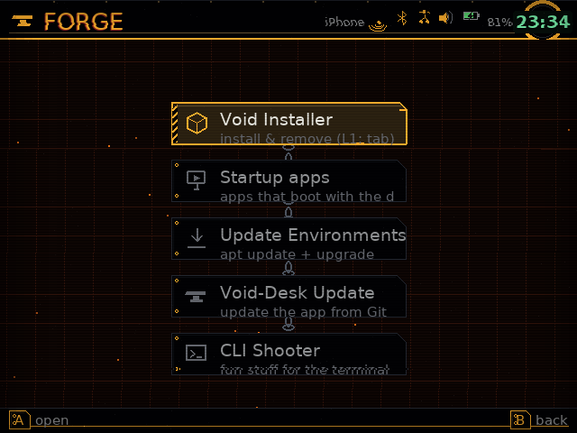
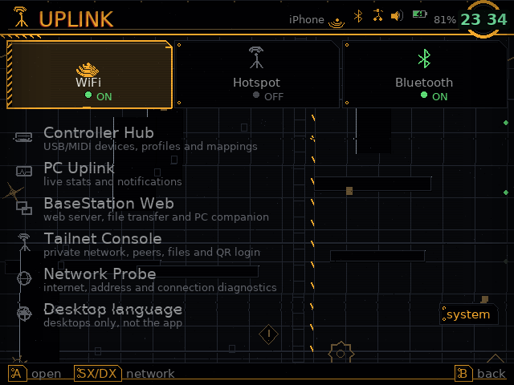
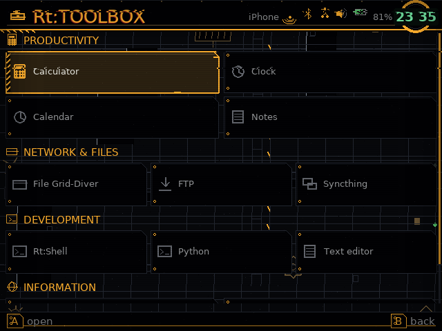
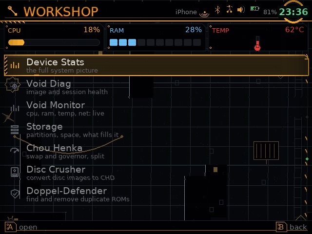
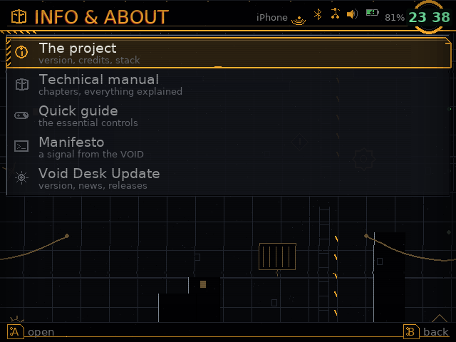

#  ◈ Void-Desk

**The definitive desktop layer for muOS.**
*A real Linux machine lives inside your handheld. VoidDesk is how you drive it.*

<!--
  ╔══════════════════════════════════════════════════════════════════════════╗
  ║  VOID-DESK v10.2.1-NEXUS  —  README.md  —  SPDW Factory Lab             ║
  ║  "The void does not stare back. It compiles."                            ║
  ╚══════════════════════════════════════════════════════════════════════════╝
-->

<div align="center">


<br><br>

[](#)
[](#)
[](#)
[](#)
[](#)
[](#)
[](#)

</div>

---

> <div style="border-left: 4px solid #E74C3C; padding: 20px 24px; background: #0a0a0a; border-radius: 0 14px 14px 0;">
> <div style="display: flex; align-items: flex-start; gap: 16px;">
> <div style="font-family: 'Courier New', monospace; font-size: 11px; color: #e74c3c; line-height: 1.4; white-space: pre;">
>        .-"""""-.
>       /  ◠   ◠  \
>       |    ‿     |
>        \  ===   /
>         '-...-'
> </div>
> <div>
> <p style="font-family: 'Impact', sans-serif; font-size: 16px; color: #E74C3C; margin: 0;">[I.R.] Minoru⁷</p>
> <p style="font-family: 'Georgia', serif; font-size: 12px; color: #666; font-style: italic; margin: 4px 0 0 0;">has hijacked the broadcast.</p>
> <br>
> <p style="font-family: 'Segoe UI', sans-serif; font-size: 14px; color: #ddd; line-height: 1.7; margin: 0;">"Oh good. Another GitHub README. I was praying for a ransom note, but I suppose a feature list is the next best thing. Try not to fall asleep before the chroot section — <b>that's where the trauma begins</b>."</p>
> </div>
> 
> </div>
> </div>

---

<h1 align="center" style="font-family: Impact, 'Arial Black', sans-serif; font-size: 40px; color: #FF6B6B; text-shadow: 2px 2px 6px #000; letter-spacing: 5px;">
📖 CONTENTS
</h1>

<p align="center" style="font-family: 'Georgia', serif; font-size: 13px; color: #555; font-style: italic; letter-spacing: 2px;">
_choose your entry point into the abyss_
</p>

<br>

```
    ┌─────────────────────────────────────────────────────┐
    │  🌑 Prologue: The Void                              │
    │  🚀 Act I — The Surface                             │
    │  🏗️ Act II — The Hubs                               │
    │  🔥 Act III — The Abyss                             │
    │  ⚙️ Act IV — The Collapse                           │
    │  🎮 Act V — The Resolution                          │
    │  ─────────────────────────────────────────────────  │
    │  📥 Installation  ·  🎮 Controls  ·  🔧 Troubleshoot │
    │  ⚖️ Credits                                       │
    └─────────────────────────────────────────────────────┘
```

---

<h1 align="center" style="font-family: 'Times New Roman', serif; font-size: 38px; color: #9B59B6; letter-spacing: 4px; font-style: italic;">
🌑 PROLOGUE: THE VOID
</h1>

<p align="center" style="font-family: 'Georgia', serif; font-size: 13px; color: #444; font-style: italic; letter-spacing: 3px;">
_<b>"In the beginning, there was only the framebuffer. And it was good."</b>_
</p>

<br>

<p style="font-family: 'Segoe UI', sans-serif; font-size: 16px; color: #ddd; line-height: 1.9;">
Stock firmware gives you emulators and stops. <b style="font-size: 19px; color: #fff;">VoidDesk</b> starts from a different axiom.
</p>

<p style="font-family: 'Georgia', serif; font-size: 15px; color: #aaa; line-height: 1.8; font-style: italic;">
A handheld with an ARM SoC and a screen is a <b>computer</b>. It deserves to be treated like one.
</p>

<p style="font-family: 'Courier New', monospace; font-size: 13px; color: #888; line-height: 1.7;">
Under the hood, VoidDesk bootstraps real Linux desktops — <b>XFCE</b>, <b>IceWM</b>, <b>LXDE</b> — each in its own Ubuntu chroot, launched on demand, never interfering with the host. On top of that, VoidDesk <i>is itself</i> a complete native interface: menus, file manager, text editor, real terminal, networking suite, controller hub, media vault, diagnostics — all drawn straight to <code>/dev/fb0</code>.
</p>

<div style="background: #000; border: 1px solid #222; border-radius: 10px; padding: 20px; margin: 22px 0;">
<pre style="font-family: 'Courier New', monospace; font-size: 14px; color: #e74c3c; text-align: center; margin: 0; line-height: 1.6;">
╔═════════════════════════════════════════════════════╗
║                                                     ║
║     NO X SERVER.  NO COMPOSITOR.  NO GPU.          ║
║                                                     ║
║     Just a game loop, a framebuffer,                ║
║     and a <b>death wish</b>.                              ║
║                                                     ║
╚═════════════════════════════════════════════════════╝
</pre>
</div>

<p style="font-family: 'Verdana', sans-serif; font-size: 13px; color: #999; line-height: 1.7;">
Everything is <b>D-Pad first</b>. No mouse. No keyboard assumptions. No patience required.
</p>

> <div style="border-left: 3px solid #F39C12; padding: 16px 20px; background: #0f0f0f; border-radius: 0 10px 10px 0;">
> <div style="display: flex; align-items: flex-start; gap: 14px;">
> <div style="font-family: 'Courier New', monospace; font-size: 10px; color: #F39C12; line-height: 1.3; white-space: pre;">
>          _____
>         /     \
>        | ◠   ◠ |
>         \  ‿  /
>          |___|
> </div>
> <div>
> <p style="font-family: 'Impact', sans-serif; font-size: 15px; color: #F39C12; margin: 0;">[I.R.] Minoru⁷</p>
> <p style="font-family: 'Georgia', serif; font-size: 11px; color: #666; font-style: italic; margin: 2px 0 0 0;">is unimpressed.</p>
> <br>
> <p style="font-family: 'Segoe UI', sans-serif; font-size: 13px; color: #bbb; line-height: 1.6; margin: 0;">"Pretty colours. Orbital mechanics. Wow. Call me when your menu system can perform an emergency chroot repair at 3 AM while you're on a bus in Naples. <i>That's the real romance.</i>"</p>
> </div>
> </div>
> </div>

---

<h1 align="center" style="font-family: Impact, 'Arial Black', sans-serif; font-size: 40px; color: #3498DB; text-shadow: 2px 2px 6px #000; letter-spacing: 4px;">
🚀 ACT I — THE SURFACE
</h1>

<p align="center" style="font-family: 'Georgia', serif; font-size: 13px; color: #444; font-style: italic; letter-spacing: 2px;">
_where the user first touches the void_
</p>

<br>

<h2 style="font-family: 'Segoe UI', sans-serif; font-size: 26px; color: #9B59B6; border-bottom: 2px solid #9B59B6; padding-bottom: 8px;">
🪐 Net-Sphere: A 3D Planetarium Menu
</h2>

<p style="font-family: 'Georgia', serif; font-size: 14px; color: #999; font-style: italic; margin-bottom: 16px;">
_The home screen is no longer a list. It is a <b>navigable solar system</b>._
</p>

```
              ✦  OUTER ORBIT  ✦
         ┌───┐  ┌───┐  ┌───┐  ┌───┐
         │ F │  │ U │  │ M │  │ W │
         │ O │  │ P │  │ V │  │ O │
         │ R │  │ L │  │ A │  │ R │
         │ G │  │ I │  │ U │  │ K │
         │ E │  │ N │  │ L │  │ S │
         └───┘  └───┘  └───┘  └───┘
                ╲   ╱
                 ╲ ╱
           ┌─────────────┐
           │   🌌 CORE   │
           │   START     │
           │  SESSION    │
           └─────────────┘
                ╱ ╲
               ╱   ╲
         ┌───┐  ┌───┐  ┌───┐  ┌───┐
         │ R │  │ I │  │ S │  │ E │
         │ T │  │ N │  │ E │  │ N │
         │ : │  │ F │  │ T │  │ D │
         │ T │  │ O │  │ T │  │   │
         │ B │  │   │  │ G │  │ N │
         │ O │  │   │  │ S │  │ O │
         │ X │  │   │  │   │  │ D │
         └───┘  └───┘  └───┘  └───┘
              ✦  INNER ORBIT  ✦
```

<p style="font-family: 'Verdana', sans-serif; font-size: 12px; color: #888; line-height: 1.7;">
<b>Dual orbit system</b> — Inner ring (START SESSION) and outer rings with independent rotation. Each node drifts in real-time; each planet has its own speed, size, and colour signature. A procedural nebula pulses behind the scene, keyed to the selected node.
</p>



---

<h3 style="font-family: 'Times New Roman', serif; font-size: 22px; color: #E67E22; font-style: italic;">
🎨 Five Home Menu Styles
</h3>

<p style="font-family: 'Georgia', serif; font-size: 13px; color: #777; font-style: italic; margin-bottom: 12px;">
_Press <b>Y</b> to cycle through realities._
</p>

```
┌────────┬────────┬────────┬────────┬────────┐
│ BLAME! │  HUD   │Terminal│ Orbit  │ Nexus  │
│════════│════════│════════│════════│════════│
│ Dense  │Tactical│ Green  │ Radial │  3D    │
│ mega-  │ heads- │ phos-  │ drift  │ Plane- │
│struct  │  up    │ phor   │        │ tarium │
│ grid   │ display│  CRT   │        │(default│
└────────┴────────┴────────┴────────┴────────┘
```

---

<h3 style="font-family: 'Georgia', serif; font-size: 22px; color: #1ABC9C;">
🎭 Visual Identity
</h3>

<div style="display: grid; grid-template-columns: 1fr 1fr; gap: 10px;">
<div style="background: #111; border: 1px solid #2a2a2a; border-radius: 10px; padding: 14px;">
<p style="font-family: 'Impact', sans-serif; font-size: 16px; color: #9B59B6; margin: 0;">🎨 Colour Themes</p>
<p style="font-family: 'Courier New', monospace; font-size: 11px; color: #666; margin: 6px 0 0 0;"><i>Amber · Crimson · Cyan · Green · Steel</i></p>
</div>
<div style="background: #111; border: 1px solid #2a2a2a; border-radius: 10px; padding: 14px;">
<p style="font-family: 'Impact', sans-serif; font-size: 16px; color: #3498DB; margin: 0;">⚙️ VFX Sliders</p>
<p style="font-family: 'Courier New', monospace; font-size: 11px; color: #666; margin: 6px 0 0 0;"><i>BG · Transitions · Effects — 0→5</i></p>
</div>
<div style="background: #111; border: 1px solid #2a2a2a; border-radius: 10px; padding: 14px;">
<p style="font-family: 'Impact', sans-serif; font-size: 16px; color: #2ECC71; margin: 0;">📏 Text Size</p>
<p style="font-family: 'Courier New', monospace; font-size: 11px; color: #666; margin: 6px 0 0 0;"><i>Four scales for every eye</i></p>
</div>
<div style="background: #111; border: 1px solid #2a2a2a; border-radius: 10px; padding: 14px;">
<p style="font-family: 'Impact', sans-serif; font-size: 16px; color: #E67E22; margin: 0;">🌆 Living Background</p>
<p style="font-family: 'Courier New', monospace; font-size: 11px; color: #666; margin: 6px 0 0 0;"><i>Grid, gears, fans, LEDs, glitches</i></p>
</div>
</div>

<br>

> <div style="background: linear-gradient(90deg, #1a1a2e, #16213e); border-left: 4px solid #E67E22; padding: 16px 20px; border-radius: 0 12px 12px 0; color: #ccc;">
> <p style="font-family: 'Impact', sans-serif; font-size: 16px; color: #E67E22; margin: 0;">⚡ Real Transitions</p>
> <p style="font-family: 'Georgia', serif; font-size: 13px; color: #888; margin: 4px 0 0 0; font-style: italic;">Mechanical overshoot, not flat fades</p>
> <p style="font-family: 'Impact', sans-serif; font-size: 16px; color: #E67E22; margin: 12px 0 0 0;">🎬 Boot Sequence</p>
> <p style="font-family: 'Georgia', serif; font-size: 13px; color: #888; margin: 4px 0 0 0; font-style: italic;">Rotating light-wipe reveal</p>
> </div>

---

<h1 align="center" style="font-family: Impact, 'Arial Black', sans-serif; font-size: 40px; color: #E74C3C; text-shadow: 2px 2px 6px #000; letter-spacing: 4px;">
🏗️ ACT II — THE HUBS
</h1>

<p align="center" style="font-family: 'Georgia', serif; font-size: 13px; color: #444; font-style: italic; letter-spacing: 2px;">
_six primary worlds. one entry point. no exit._
</p>

<br>

```
                    🌌 NET-SPHERE
                         │
        ┌────────────────┼────────────────┐
        │                │                │
   ┌────▼────┐     ┌────▼────┐     ┌────▼────┐
   │  🖥️     │     │  🔥     │     │  🌐     │
   │ START   │     │  THE    │     │ UPLINK  │
   │SESSION  │     │ FORGE   │     │         │
   └────┬────┘     └────┬────┘     └────┬────┘
        │               │               │
   ┌────▼────┐     ┌────▼────┐     ┌────▼────┐
   │  🎬     │     │  🧰     │     │  ⚡     │
   │ MEDIA   │     │Rt:TOOLBX│     │ WORKSHOP│
   │ VAULT   │     │         │     │         │
   └─────────┘     └─────────┘     └─────────┘
        │                │                │
        └────────────────┼────────────────┘
                         │
              ┌──────────▼──────────┐
              │  ℹ️ INFO  │  ⚙️ SET │
              │   & ABOUT │  TINGS  │
              └──────────┬──────────┘
                         │
                      🔚 END
```

---

<h2 style="font-family: 'Impact', sans-serif; font-size: 26px; color: #9B59B6;">

🖥️ START SESSION
</h2>

<p style="font-family: 'Georgia', serif; font-size: 12px; color: #777; font-style: italic; clear: both; margin-top: 8px;">
_Desktop Environments — where the void meets the desktop_
</p>

<p style="font-family: 'Segoe UI', sans-serif; font-size: 15px; color: #ccc; line-height: 1.7;">
<b style="font-size: 17px; color: #fff;">Three real desktops.</b> <i>One chroot. Zero clutter.</i>
</p>

```
┌─────────────────────────────────────────┐
│     🖥️  START SESSION  —  DE Manager     │
├─────────────────────────────────────────┤
│  [XFCE]      [IceWM]       [LXDE]     │
│  ┌─────┐     ┌─────┐       ┌─────┐    │
│  │ 🐧  │     │ ⚡  │       │ 🪶  │    │
│  │FULL │     │TURBO│       │LIGHT│    │
│  │featured│   │fast │       │lean │    │
│  └─────┘     └─────┘       └─────┘    │
│                                         │
│  L1/R1: cycle tabs   A: launch          │
│  X: repair          B: back             │
└─────────────────────────────────────────┘
```

<p style="font-family: 'Verdana', sans-serif; font-size: 12px; color: #888; line-height: 1.7;">
Everything lives in a single <code>xfce.img</code> — loop-mounted, isolated, repairable. Your muOS installation is <b>completely untouched</b>. Corruption only affects the image, never the host.
</p>

<div align="center">




</div>

---

<h2 style="font-family: 'Impact', sans-serif; font-size: 26px; color: #E74C3C;">

🔥 THE FORGE
</h2>

<p style="font-family: 'Georgia', serif; font-size: 12px; color: #777; font-style: italic; clear: both; margin-top: 8px;">
_The forge where software is born._
</p>

<p style="font-family: 'Segoe UI', sans-serif; font-size: 13px; color: #aaa; line-height: 1.7;">
80+ installable components across <b>11 categories</b>. Expandable. Multi-select. Batch operations with live progress. Destructive operations <i>always</i> show what they're about to do first.
</p>

```
┌─────────────────────────────────────────┐
│         🔥  THE FORGE  —  Installer      │
├─────────────────────────────────────────┤
│  ▼ System       [✓] xfce4-terminal     │
│  ▼ Multimedia    [✓] mpv                │
│  ▼ Dev Tools     [ ] gcc                │
│  ▼ Games         [✓] cmatrix            │
│  ▼ Network       [✓] curl               │
│  ▼ CLI Shooter   [✓] nyancat            │
│                                         │
│  [Install 5]  [Remove 0]  [Clean Apt]  │
└─────────────────────────────────────────┘
```



> <div style="background: #1a1500; border-left: 3px solid #F1C40F; padding: 12px 16px; color: #ccc; border-radius: 0 10px 10px 0;">
> <p style="font-family: 'Impact', sans-serif; font-size: 14px; color: #F1C40F; margin: 0;">📝 NOTE</p>
> <p style="font-family: 'Courier New', monospace; font-size: 11px; color: #888; margin: 4px 0 0 0;">CLI Shooter is <i>hidden by default</i>. Enable via <b>SETTINGS → Developer Options</b>.</p>
> </div>

---

<h2 style="font-family: 'Impact', sans-serif; font-size: 26px; color: #3498DB;">

🌐 UPLINK
</h2>

<p style="font-family: 'Georgia', serif; font-size: 12px; color: #777; font-style: italic; clear: both; margin-top: 8px;">
_Your handheld's nervous system._
</p>

<h3 style="font-family: 'Times New Roman', serif; font-size: 18px; color: #9B59B6; font-style: italic;">
📶 Wireless Triad
</h3>

<div style="display: grid; grid-template-columns: repeat(3, 1fr); gap: 8px; margin: 12px 0;">
<div style="background: #0d0d1a; border: 1px solid #3a3a5a; border-radius: 10px; padding: 14px; text-align: center;">
<p style="font-family: 'Impact', sans-serif; font-size: 15px; color: #9b59b6; margin: 0;">📶 Wi-Fi</p>
<p style="font-family: 'Courier New', monospace; font-size: 10px; color: #666; margin: 8px 0 0 0; line-height: 1.5;"><i>wpa_cli + iw fallback</i></p>
</div>
<div style="background: #1a0d0d; border: 1px solid #5a3a3a; border-radius: 10px; padding: 14px; text-align: center;">
<p style="font-family: 'Impact', sans-serif; font-size: 15px; color: #e74c3c; margin: 0;">🔥 Hotspot</p>
<p style="font-family: 'Courier New', monospace; font-size: 10px; color: #666; margin: 8px 0 0 0; line-height: 1.5;"><i>hostapd + dnsmasq</i></p>
</div>
<div style="background: #0d0d1a; border: 1px solid #3a3a5a; border-radius: 10px; padding: 14px; text-align: center;">
<p style="font-family: 'Impact', sans-serif; font-size: 15px; color: #3498db; margin: 0;">🔵 Bluetooth</p>
<p style="font-family: 'Courier New', monospace; font-size: 10px; color: #666; margin: 8px 0 0 0; line-height: 1.5;"><i>bltMuos cascade</i></p>
</div>
</div>

<h3 style="font-family: 'Times New Roman', serif; font-size: 18px; color: #2ECC71; font-style: italic;">
🔗 PC Integration
</h3>

```
┌─────────────┐      HTTP/JSON      ┌─────────────┐
│   💻 PC     │◀══════════════════▶│  VoidDesk   │
│ Uplink App  │    basestation.py   │   Handheld  │
│             │                     │             │
│  live stats │◀─── notifications ─▶│  screenshot │
│  auto-conn  │◀─── file transfer ─▶│  requests   │
└─────────────┘                     └─────────────┘
         │                                   │
         │         ┌─────────────┐          │
         └────────▶│ 🌐 BaseStation│◀─────────┘
                   │   Web :8765   │
                   │  drag. drop.  │
                   └─────────────┘
```

<h3 style="font-family: 'Times New Roman', serif; font-size: 18px; color: #F1C40F; font-style: italic;">
📡 Network Infrastructure
</h3>

<table style="width: 100%; border-collapse: collapse; margin: 12px 0; font-size: 11px;">
<tr style="background: #0d1117;">
<th style="border: 1px solid #30363d; padding: 8px; font-family: 'Impact', sans-serif; color: #58a6ff; text-align: left;">Service</th>
<th style="border: 1px solid #30363d; padding: 8px; font-family: 'Impact', sans-serif; color: #58a6ff; text-align: left;">Backend</th>
<th style="border: 1px solid #30363d; padding: 8px; font-family: 'Impact', sans-serif; color: #58a6ff; text-align: left;">What it does</th>
</tr>
<tr>
<td style="border: 1px solid #30363d; padding: 8px; font-family: 'Verdana', sans-serif; color: #ccc;">🔒 <b>Tailscale</b></td>
<td style="border: 1px solid #30363d; padding: 8px; font-family: 'Courier New', monospace; color: #aaa;"><code>tailscaled</code></td>
<td style="border: 1px solid #30363d; padding: 8px; font-family: 'Verdana', sans-serif; color: #aaa;">Peers, exit nodes, Taildrop, QR login</td>
</tr>
<tr style="background: #161b22;">
<td style="border: 1px solid #30363d; padding: 8px; font-family: 'Verdana', sans-serif; color: #ccc;">🔄 <b>Syncthing</b></td>
<td style="border: 1px solid #30363d; padding: 8px; font-family: 'Courier New', monospace; color: #aaa;">REST API</td>
<td style="border: 1px solid #30363d; padding: 8px; font-family: 'Verdana', sans-serif; color: #aaa;"><i>Real</i> integration, not a web shortcut</td>
</tr>
<tr>
<td style="border: 1px solid #30363d; padding: 8px; font-family: 'Verdana', sans-serif; color: #ccc;">🎮 <b>Controller Hub</b></td>
<td style="border: 1px solid #30363d; padding: 8px; font-family: 'Courier New', monospace; color: #aaa;"><code>evdev</code></td>
<td style="border: 1px solid #30363d; padding: 8px; font-family: 'Verdana', sans-serif; color: #aaa;">HID & MIDI discovery, mapping, profiles</td>
</tr>
<tr style="background: #161b22;">
<td style="border: 1px solid #30363d; padding: 8px; font-family: 'Verdana', sans-serif; color: #ccc;">🧭 <b>Network Probe</b></td>
<td style="border: 1px solid #30363d; padding: 8px; font-family: 'Courier New', monospace; color: #aaa;">Multi-tool</td>
<td style="border: 1px solid #30363d; padding: 8px; font-family: 'Verdana', sans-serif; color: #aaa;">Internet, IP, gateway, status at a glance</td>
</tr>
</table>



> <div style="background: #1a0a0a; border: 1px dashed #e74c3c; border-radius: 6px; padding: 10px 14px; color: #c88; font-family: 'Courier New', monospace; font-size: 11px; line-height: 1.5;">
> <b>⚠️ WARNING</b> — On most RTL chipsets, hotspot and client mode <i>cannot coexist</i>. VoidDesk warns you and auto-switches.
> </div>

---

<h2 style="font-family: 'Impact', sans-serif; font-size: 26px; color: #E67E22;">

🎬 MEDIA VAULT
</h2>

<p style="font-family: 'Georgia', serif; font-size: 12px; color: #777; font-style: italic; clear: both; margin-top: 8px;">
_Where silence goes to die._
</p>

```
┌─────────────┬─────────────┬─────────────┬─────────────┐
│   📻 VOID   │   📺 VOID   │   📚 MEDIA  │   🔊 BGM    │
│    RADIO    │   CAST IPTV │   LIBRARY   │  NORMALIZER │
├─────────────┼─────────────┼─────────────┼─────────────┤
│ SomaFM      │ M3U / EPG   │ SD browse   │ ffmpeg      │
│ RAI         │ TV Guide    │ playlists   │ loudnorm    │
│ Radio Deejay│ PVR ready   │ audio/video │ 2-pass/1-p  │
│ Tekno Italia│ companion   │             │ simple mode │
│ Sleep timer │ app         │             │             │
└─────────────┴─────────────┴─────────────┴─────────────┘
```

> <div style="background: #0d1117; border-left: 3px solid #58a6ff; padding: 10px 14px; color: #8b949e; font-size: 11px;">
> <b style="color:#58a6ff;">🔧 TECH NOTE</b> — Void Radio uses <code>mpv --no-video</code>. Sleep timer fades volume over 30s before stopping.
> </div>

---

<h2 style="font-family: 'Impact', sans-serif; font-size: 26px; color: #1ABC9C;">

🧰 Rt:TOOLBOX
</h2>

<p style="font-family: 'Georgia', serif; font-size: 12px; color: #777; font-style: italic; clear: both; margin-top: 8px;">
_The Swiss Army knife, re-forged in a dying star._
</p>

```
┌─────────────────────────────────────────────────────────┐
│                  Rt:TOOLBOX — 12 Tools                    │
├─────────┬─────────┬─────────┬─────────┬───────────────┤
│🖥️ Shell │🧮 Calc  │🕐 Clock │📅 Cal   │📝 Notes       │
│PTY+kbd  │Sci/Rintro│6 faces  │events   │masonry board  │
├─────────┼─────────┼─────────┼─────────┼───────────────┤
│🗞️ RSS   │🌤️ Weather│📁 Files │🔌 FTP   │🔄 Syncthing   │
│ENG+ITA  │multi-city│clipboard│profiles │REST panel     │
├─────────┼─────────┴─────────┴─────────┴───────────────┤
│🐍 Python│✏️ Text Editor — VOID EDIT (D-pad native)   │
│REPL     │                                              │
└─────────┴──────────────────────────────────────────────┘
```



> <div style="background: #1a1500; border-left: 3px solid #F1C40F; padding: 10px 14px; color: #ccc; border-radius: 0 10px 10px 0;">
> <b style="color:#F1C40F;">💡 PRO TIP</b> — Calculator's "Rintro" = HP RPN style. If you know, you know. If you don't, stick to Basic.
> </div>

---

<h2 style="font-family: 'Impact', sans-serif; font-size: 26px; color: #F1C40F;">

⚡ WORKSHOP
</h2>

<p style="font-family: 'Georgia', serif; font-size: 12px; color: #777; font-style: italic; clear: both; margin-top: 8px;">
_The engine room. Bring a wrench._
</p>

```
┌─────────────────────────────────────────────────────────┐
│  📊 Device Stats  │  🩺 Void Diag  │  📈 Void Monitor   │
│  full system    │  health scan   │  live graphs       │
├─────────────────────────────────────────────────────────┤
│  💾 Storage     │  ⚡ Chou Henka  │  💿 Disc Crusher   │
│  usage breakdown│  CPU/swap ctrl  │  cue/gdi→chd      │
├─────────────────────────────────────────────────────────┤
│  👥 Doppel-Def  │  📋 Log Reg     │  💾 Image Backup   │
│  dup ROM finder │  archive logs   │  gzip xfce.img    │
└─────────────────────────────────────────────────────────┘
```



> <div style="background: #1a1a1a; border: 1px solid #333; border-radius: 8px; padding: 14px; font-family: 'Courier New', monospace; font-size: 11px; color: #777; line-height: 1.6;">
> <b style="color:#e74c3c; font-family: 'Impact', sans-serif;">🔍 Doppel-Defender Engine</b><br>
> Disc tags: <code>(Disc 1)</code> <code>[CD2]</code> · Roman numerals: <code>FF IV</code>=<code>FF 4</code> · Regions: <code>(USA)</code> <code>[T+Eng]</code>
> </div>

---

<h3 style="font-family: 'Times New Roman', serif; font-size: 20px; color: #3498DB; font-style: italic;">
📊 System Overlays
</h3>

```
┌─────────────────┬─────────────────┬─────────────────┐
│    R2 TABLET    │  L2 NET-SPHERE  │  M MEDIA PANEL  │
│   Terminal ID   │  WiFi/BT/USB    │  Radio controls │
│   Operator name │  status glance  │  (when active)  │
│   Theme/Version │                 │                 │
└─────────────────┴─────────────────┴─────────────────┘
         │                │                │
         └────────────────┴────────────────┘
                          │
              ┌───────────▼───────────┐
              │   NOTIFICATION SYS    │
              │  cable animations     │
              │  severity levels      │
              └───────────────────────┘
```

> <div style="border-left: 3px solid #9B59B6; padding: 14px 18px; background: #0f0f0f; border-radius: 0 10px 10px 0;">
> <div style="display: flex; align-items: flex-start; gap: 14px;">
> <div style="font-family: 'Courier New', monospace; font-size: 10px; color: #9B59B6; line-height: 1.3; white-space: pre;">
>         ╭─────╮
>         │◠   ◠│
>         │  ‿  │
>         ╰──┬──╯
> </div>
> <div>
> <p style="font-family: 'Impact', sans-serif; font-size: 15px; color: #9B59B6; margin: 0;">[I.R.] Minoru⁷</p>
> <p style="font-family: 'Georgia', serif; font-size: 11px; color: #666; font-style: italic; margin: 2px 0 0 0;">is having an existential crisis.</p>
> <br>
> <p style="font-family: 'Segoe UI', sans-serif; font-size: 13px; color: #bbb; line-height: 1.6; margin: 0;">"You people. You put a PTY terminal, a CHD converter, a MIDI controller mapper, and a <i>Braille ASCII logo</i> inside a Pygame loop running on a device that doesn't even have a GPU. This isn't software. This is a cry for help. And I respect that."</p>
> </div>
> </div>
> </div>

---

<h1 align="center" style="font-family: Impact, 'Arial Black', sans-serif; font-size: 40px; color: #E74C3C; text-shadow: 2px 2px 6px #000; letter-spacing: 4px;">
🔥 ACT III — THE ABYSS
</h1>

<p align="center" style="font-family: 'Georgia', serif; font-size: 13px; color: #444; font-style: italic; letter-spacing: 2px;">
_this is where we stop being polite and start being real_
</p>

<br>

<h2 style="font-family: 'Impact', sans-serif; font-size: 24px; color: #9B59B6;">
🎮 The Controller Hub
</h2>

<p style="font-family: 'Georgia', serif; font-size: 13px; color: #999; font-style: italic; margin-bottom: 14px;">
_VoidDesk does not just <b>use</b> your gamepad. It <b>interrogates</b> it._
</p>

```
    USB DEVICE ──▶┌─────────────────┐
                  │  Controller Hub │
    MIDI KEYBD ──▶│                 │
                  │  /dev/input/*   │
    FIGHT STICK ─▶│  evdev raw      │
                  │  no SDL layer   │
                  └────────┬────────┘
                           │
              ┌────────────┼────────────┐
              ▼            ▼            ▼
        ┌────────┐   ┌────────┐   ┌────────┐
        │ QJoyPad│   │ Binding│   │ Profile│
        │ .lyt   │   │ Engine │   │  Mgr   │
        │generator│   │capture │   │save/load│
        └────────┘   └────────┘   └────────┘
```

<p style="font-family: 'Verdana', sans-serif; font-size: 12px; color: #888; line-height: 1.7;">
<b>Direct <code>/dev/input/event*</code> reading</b> — No SDL layer, no latency. USB HID & MIDI support: plug in a Korg NanoKey, a fight stick, a drum kit. VoidDesk <i>will see it</i>. Real-time binding engine: capture any signal, assign console actions or PC commands. Save, load, and delete complete binding sets per device.
</p>

<p style="font-family: 'Courier New', monospace; font-size: 11px; color: #666; line-height: 1.6;">
<b>Diagnostics:</b> <code>lsusb</code> · ALSA cards · <code>dmesg</code> filtering · MIDI module probing · <code>/dev</code> repopulation
</p>

---

<h2 style="font-family: 'Impact', sans-serif; font-size: 24px; color: #2ECC71;">
🖥️ The Terminal (Rt:Shell)
</h2>

<p style="font-family: 'Georgia', serif; font-size: 13px; color: #999; font-style: italic; margin-bottom: 14px;">
_Not a fake shell. A <b>real PTY</b> running <code>/bin/bash</code>._
</p>

<div style="background: #000; border: 2px solid #0a0; border-radius: 8px; padding: 16px; font-family: 'Courier New', monospace; color: #0a0; margin: 14px 0;">
<pre style="margin: 0; font-size: 11px; line-height: 1.5;">
╔═══════════════════════════════════════════════╗
║  <b>VOID SHELL v3.1</b>  —  PTY ACTIVE              ║
║  /dev/pts/0  |  bash 5.1.16  |  60fps       ║
╠═══════════════════════════════════════════════╣
║  • ANSI emulation via rtshell.TermBuffer      ║
║  • On-screen keyboard (lower/upper/symbols)   ║
║  • Hotkey row: ^C ^D ^L ^Z TAB ESC            ║
║  • Command history (200 entries)              ║
║  • Braille ASCII welcome logo                 ║
╚═══════════════════════════════════════════════╝
</pre>
</div>

---

<h2 style="font-family: 'Impact', sans-serif; font-size: 24px; color: #E67E22;">
💿 Disc Crusher
</h2>

<p style="font-family: 'Georgia', serif; font-size: 13px; color: #999; font-style: italic; margin-bottom: 14px;">
_Batch-converts disc images to CHD._
</p>

```
    .cue / .gdi  ──▶  parse refs  ──▶  validate  ──▶  queue
                                                        │
                                                        ▼
                                                  ┌─────────┐
                                                  │ chdman  │
                                                  │createcd │
                                                  └────┬────┘
                                                       │
                                                  verify?
                                                  ┌────┴────┐
                                                  ▼         ▼
                                              ✓ pass    ✗ fail
                                              mark      log &
                                              done      retry
```

<p style="font-family: 'Courier New', monospace; font-size: 11px; color: #777; line-height: 1.6;">
<b>Supported:</b> PS1 · Dreamcast · Saturn · Sega CD · PC Engine CD · Neo Geo CD
</p>

> <div style="border-left: 3px solid #E74C3C; padding: 14px 18px; background: #0f0f0f; border-radius: 0 10px 10px 0;">
> <div style="display: flex; align-items: flex-start; gap: 14px;">
> <div style="font-family: 'Courier New', monospace; font-size: 10px; color: #E74C3C; line-height: 1.3; white-space: pre;">
>          ┌───┐
>          │◠_◠│
>          │ ‿ │
>          └───┘
> </div>
> <div>
> <p style="font-family: 'Impact', sans-serif; font-size: 15px; color: #E74C3C; margin: 0;">[I.R.] Minoru⁷</p>
> <p style="font-family: 'Georgia', serif; font-size: 11px; color: #666; font-style: italic; margin: 2px 0 0 0;">has stopped blinking.</p>
> <br>
> <p style="font-family: 'Segoe UI', sans-serif; font-size: 13px; color: #bbb; line-height: 1.6; margin: 0;">"You are running a Debian chroot inside a Pygame app on a handheld that costs less than a dinner in Milan. The framebuffer is being bit-banged. The terminal is a PTY. The WiFi manager falls back to rewriting <code>wpa_supplicant.conf</code> and killing the daemon if the control socket doesn't respond. This is not 'retro computing.' This is <b>survival computing</b>. And you are all going to die beautiful deaths."</p>
> </div>
> </div>
> </div>

---

<h1 align="center" style="font-family: Impact, 'Arial Black', sans-serif; font-size: 40px; color: #F1C40F; text-shadow: 2px 2px 6px #000; letter-spacing: 4px;">
⚙️ ACT IV — THE COLLAPSE
</h1>

<p align="center" style="font-family: 'Georgia', serif; font-size: 13px; color: #444; font-style: italic; letter-spacing: 2px;">
_under the hood, where the magic is actually duct tape_
</p>

<br>

<h2 style="font-family: 'Times New Roman', serif; font-size: 24px; color: #3498DB; font-style: italic;">
Under the Hood
</h2>

<p style="font-family: 'Georgia', serif; font-size: 14px; color: #aaa; line-height: 1.8; font-style: italic;">
VoidDesk's own interface is a single pygame application drawing directly to <code>/dev/fb0</code>. The desktop environments it manages are a different animal entirely: a real Ubuntu chroot in an ext4 disk image, bootstrapped with <code>debootstrap</code>, mounted and launched through a minimal X session only when you ask for it.
</p>

<p style="font-family: 'Segoe UI', sans-serif; font-size: 12px; color: #888; line-height: 1.6;">
The two worlds meet at a small, deliberate seam — a handful of shell scripts that mount, launch, and clean up, and a config file both sides read.
</p>

<div style="background: #000; border: 1px solid #222; border-radius: 8px; padding: 14px; margin: 14px 0;">
<p style="font-family: 'Impact', sans-serif; font-size: 16px; color: #e74c3c; text-align: center; margin: 0; letter-spacing: 2px;">
NO GPU. NO COMPOSITOR. NO WASTED CYCLES.
</p>
<p style="font-family: 'Courier New', monospace; font-size: 10px; color: #444; text-align: center; margin: 6px 0 0 0;">
Every animation is software-rendered on hardware never meant to run a desktop.
</p>
</div>

```
┌─────────────────────────────────────────────────────────────┐
│                    🖥️  muOS HOST                          │
│  ┌─────────┐  ┌─────────┐  ┌─────────┐                      │
│  │/dev/fb0 │  │/dev/inp│  │zram/swp│                      │
│  │RGB565   │──│ut/evdev│  │        │                      │
│  └────┬────┘  └────┬────┘  └────┬────┘                      │
│       └─────────────┴──────────┘                            │
│                      │                                      │
│              ┌───────▼────────┐                             │
│              │  VoidDesk UI   │                             │
│              │ (Pygame Loop)  │                             │
│              └───────┬────────┘                             │
│                      │                                      │
│              ┌───────▼────────┐                             │
│              │ Chroot Manager │                             │
│              └───────┬────────┘                             │
└──────────────────────┼──────────────────────────────────────┘
                       │ loop-mount + bind
                       ▼
┌─────────────────────────────────────────────────────────────┐
│              📦  UBUNTU CHROOT (ext4)                        │
│  ┌─────────┐  ┌─────────┐  ┌─────────┐                     │
│  │ Xorg    │──│XFCE/Ice │──│ xterm   │                     │
│  │ + fbdev │  │WM/LXDE  │  │ mpv     │                     │
│  └─────────┘  └─────────┘  └─────────┘                     │
└─────────────────────────────────────────────────────────────┘

┌─────────────────────────────────────────────────────────────┐
│                    🌐  UPLINK STACK                          │
│  ┌────────┐┌────────┐┌────────┐┌────────┐┌────────┐       │
│  │wpa_sup ││hostapd ││bluetoot││tailscal││BaseStn │       │
│  │plicant ││+dnsmasq││  hd    ││   ed   ││ :8765  │       │
│  └───┬────┘└───┬────┘└───┬────┘└───┬────┘└───┬────┘       │
│      ▼         ▼         ▼         ▼         ▼              │
│    WiFi     Hotspot      BT      Tailnet   PC Link         │
│                                                             │
│         VoidDesk ◀──REST──▶ Syncthing                     │
│         VoidDesk ◀──HTTP──▶ BaseStation                     │
└─────────────────────────────────────────────────────────────┘
```

---

<h3 style="font-family: 'Impact', sans-serif; font-size: 20px; color: #1ABC9C;">
🔬 Key Technical Details
</h3>

<table style="width: 100%; border-collapse: collapse; margin: 14px 0; font-size: 11px;">
<tr style="background: #0d1117;">
<th style="border: 1px solid #30363d; padding: 8px; font-family: 'Impact', sans-serif; color: #1abc9c; text-align: left;">Layer</th>
<th style="border: 1px solid #30363d; padding: 8px; font-family: 'Impact', sans-serif; color: #1abc9c; text-align: left;">Implementation</th>
</tr>
<tr>
<td style="border: 1px solid #30363d; padding: 8px; font-family: 'Verdana', sans-serif; color: #ccc;"><b>Pygame runtime</b></td>
<td style="border: 1px solid #30363d; padding: 8px; font-family: 'Courier New', monospace; color: #aaa;">Bootstrapped on first run from PyPI</td>
</tr>
<tr style="background: #161b22;">
<td style="border: 1px solid #30363d; padding: 8px; font-family: 'Verdana', sans-serif; color: #ccc;"><b>Framebuffer</b></td>
<td style="border: 1px solid #30363d; padding: 8px; font-family: 'Courier New', monospace; color: #aaa;">Direct <code>/dev/fb0</code> — RGB565 / XRGB8888</td>
</tr>
<tr>
<td style="border: 1px solid #30363d; padding: 8px; font-family: 'Verdana', sans-serif; color: #ccc;"><b>Event input</b></td>
<td style="border: 1px solid #30363d; padding: 8px; font-family: 'Courier New', monospace; color: #aaa;">Direct <code>/dev/input/event*</code> — no X11</td>
</tr>
<tr style="background: #161b22;">
<td style="border: 1px solid #30363d; padding: 8px; font-family: 'Verdana', sans-serif; color: #ccc;"><b>Chroot</b></td>
<td style="border: 1px solid #30363d; padding: 8px; font-family: 'Courier New', monospace; color: #aaa;">Loop-mounted ext4 + bind mounts</td>
</tr>
<tr>
<td style="border: 1px solid #30363d; padding: 8px; font-family: 'Verdana', sans-serif; color: #ccc;"><b>Swap</b></td>
<td style="border: 1px solid #30363d; padding: 8px; font-family: 'Courier New', monospace; color: #aaa;">zram first, fallback swapfile</td>
</tr>
<tr style="background: #161b22;">
<td style="border: 1px solid #30363d; padding: 8px; font-family: 'Verdana', sans-serif; color: #ccc;"><b>Hotspot</b></td>
<td style="border: 1px solid #30363d; padding: 8px; font-family: 'Courier New', monospace; color: #aaa;">Native <code>hostapd</code> + <code>dnsmasq</code></td>
</tr>
<tr>
<td style="border: 1px solid #30363d; padding: 8px; font-family: 'Verdana', sans-serif; color: #ccc;"><b>Companion PC</b></td>
<td style="border: 1px solid #30363d; padding: 8px; font-family: 'Courier New', monospace; color: #aaa;">HTTP/JSON daemon <code>basestation.py</code></td>
</tr>
<tr style="background: #161b22;">
<td style="border: 1px solid #30363d; padding: 8px; font-family: 'Verdana', sans-serif; color: #ccc;"><b>Terminal</b></td>
<td style="border: 1px solid #30363d; padding: 8px; font-family: 'Courier New', monospace; color: #aaa;">Python PTY + <code>select</code> nonblocking I/O</td>
</tr>
<tr>
<td style="border: 1px solid #30363d; padding: 8px; font-family: 'Verdana', sans-serif; color: #ccc;"><b>Controller</b></td>
<td style="border: 1px solid #30363d; padding: 8px; font-family: 'Courier New', monospace; color: #aaa;"><code>evdev</code> → QJoyPad + HID/MIDI raw</td>
</tr>
</table>

---

<h3 style="font-family: 'Times New Roman', serif; font-size: 20px; color: #E74C3C; font-style: italic;">
🛡️ Security & Isolation Model
</h3>

```
┌─────────────────────────────────────────────┐
│              muOS Host (RO)               │
│  ┌─────────────────────────────────────┐   │
│  │        VoidDesk UI (Pygame)         │   │
│  │            ↓ r/w ↓                  │   │
│  │           data/ directory            │   │
│  └─────────────────────────────────────┘   │
│                    │                        │
│  ┌─────────────────▼─────────────────┐   │
│  │      Chroot Manager (scripts)      │   │
│  │   loop-mount + bind → xfce.img     │   │
│  │  ┌─────────────────────────────┐  │   │
│  │  │  xfce.img (ext4, ~4GB)      │  │   │
│  │  │  ┌─────┐ ┌─────┐ ┌─────┐   │  │   │
│  │  │  │XFCE │ │IceWM│ │LXDE │   │  │   │
│  │  │  └─────┘ └─────┘ └─────┘   │  │   │
│  │  └─────────────────────────────┘  │   │
│  └─────────────────────────────────────┘   │
└─────────────────────────────────────────────┘
```

> <div style="background: #0d1117; border: 1px solid #30363d; border-radius: 8px; padding: 14px; color: #8b949e;">
> <p style="font-family: 'Impact', sans-serif; font-size: 14px; color: #58a6ff; margin: 0;">🔒 ISOLATION GUARANTEE</p>
> <p style="font-family: 'Courier New', monospace; font-size: 11px; color: #8b949e; line-height: 1.6; margin: 8px 0 0 0;">The chroot <b>cannot</b> write to the host rootfs. The host <b>cannot</b> accidentally modify the chroot image while mounted. Both worlds communicate through a single JSON config and well-defined shell hooks.</p>
> </div>

---

<h1 align="center" style="font-family: Impact, 'Arial Black', sans-serif; font-size: 40px; color: #2ECC71; text-shadow: 2px 2px 6px #000; letter-spacing: 4px;">
🎮 ACT V — THE RESOLUTION
</h1>

<p align="center" style="font-family: 'Georgia', serif; font-size: 13px; color: #444; font-style: italic; letter-spacing: 2px;">
_you have reached the controls. this is not a drill_
</p>

<br>

<h2 style="font-family: 'Impact', sans-serif; font-size: 24px; color: #E67E22;">
📥 Installation
</h2>

```
┌─────────────────────────────────────────────┐
│           VOID-DESK INSTALLATION            │
├─────────────────────────────────────────────┤
│  1. Download VoidDesk_v10_XX.muxapp        │
│     from GitHub Releases                    │
│                                             │
│  2. Copy to mnt/mmc/MUOS/application/      │
│                                             │
│  3. Launch from MuOS Apps                   │
│                                             │
│  4. Pick a desktop to bootstrap            │
│     (~1.2GB download, use WiFi)            │
│                                             │
│  ⚠️  Do not power off during debootstrap.  │
│      If interrupted: START SESSION → Repair │
└─────────────────────────────────────────────┘
```

<p style="font-family: 'Verdana', sans-serif; font-size: 11px; color: #888; line-height: 1.6;">
<b>Requirements:</b> Anbernic <b>RG35XX-H</b> · <b>muOS</b> 2601 JACARANDA · ~1.5–2GB free per desktop
</p>

> <div style="background: #1a1500; border-left: 3px solid #F1C40F; padding: 12px 16px; color: #ccc; border-radius: 0 10px 10px 0;">
> <b style="color:#F1C40F; font-family: 'Impact', sans-serif;">⚠️ FIRST RUN</b>
> <p style="font-family: 'Courier New', monospace; font-size: 11px; color: #888; margin: 4px 0 0 0;">Bootstrap downloads ~1.2GB. Use <b>WiFi</b>. If interrupted, <b>Repair</b> in START SESSION resumes where it left off.</p>
> </div>

---

<h2 style="font-family: 'Impact', sans-serif; font-size: 24px; color: #3498DB;">
🎮 Controls
</h2>

<h3 style="font-family: 'Times New Roman', serif; font-size: 17px; color: #9B59B6; font-style: italic;">
Standard Navigation
</h3>

```
┌─────────┬─────────────────────────────────────────────┐
│  D-Pad  │  Navigate menus                             │
├─────────┼─────────────────────────────────────────────┤
│    A    │  Confirm / open                             │
├─────────┼─────────────────────────────────────────────┤
│    B    │  Back / cancel                              │
├─────────┼─────────────────────────────────────────────┤
│    X    │  Secondary: multi-select, detail, context │
├─────────┼─────────────────────────────────────────────┤
│    Y    │  Cycle menu style · select-all in lists   │
├─────────┼─────────────────────────────────────────────┤
│ L1 / R1 │  Switch tabs / category jump                │
├─────────┼─────────────────────────────────────────────┤
│  START  │  Collapse/expand · confirm in dialogs       │
├─────────┼─────────────────────────────────────────────┤
│ SELECT  │  Rescan / refresh                           │
└─────────┴─────────────────────────────────────────────┘
```

<h3 style="font-family: 'Times New Roman', serif; font-size: 17px; color: #E74C3C; font-style: italic;">
Nexus Menu
</h3>

```
┌─────────┬─────────────────────────────────────────────┐
│ UP/DOWN │  Rotate current orbit (prev/next planet)    │
├─────────┼─────────────────────────────────────────────┤
│ LFT/RGT │  Switch inner ↔ outer orbit                 │
├─────────┼─────────────────────────────────────────────┤
│    A    │  Open selected hub                          │
└─────────┴─────────────────────────────────────────────┘
```

<h3 style="font-family: 'Times New Roman', serif; font-size: 17px; color: #2ECC71; font-style: italic;">
Global Shortcuts
</h3>

```
┌─────────┬─────────────────────────────────────────────┐
│   R2    │  Terminal ID Tablet                         │
├─────────┼─────────────────────────────────────────────┤
│   L2    │  Net-Sphere Monitor                         │
├─────────┼─────────────────────────────────────────────┤
│    M    │  Media Panel (when radio active)            │
└─────────┴─────────────────────────────────────────────┘
```

<p style="font-family: 'Georgia', serif; font-size: 11px; color: #777; font-style: italic;">
Full reference: <b>INFO & ABOUT → Quick guide</b>.
</p>



---

<h2 style="font-family: 'Impact', sans-serif; font-size: 24px; color: #E74C3C;">
🔧 Troubleshooting
</h2>

```
┌────────────────────┬────────────────────────┬─────────────────────────┐
│ Symptom            │ First Check            │ Nuclear Option          │
├────────────────────┼────────────────────────┼─────────────────────────┤
│ Blank screen       │ data/logs/voiddesk.log │ Re-bootstrap Pygame     │
│ Desktop won't start│ START SESSION → Repair │ Reinstall (keeps data)  │
│ CLI tool missing   │ Log Registry: deps_*.log│ Re-run post-install   │
│ WiFi/BT stuck      │ Leave & re-enter panel │ Restart daemon        │
│ Out of space       │ WORKSHOP → clean apt   │ FORGE → remove unused   │
│ Controller dead    │ Controller Hub → Diag  │ HID/MIDI probe cascade  │
│ CHD fails          │ Validate .cue/.gdi refs│ Disc Crusher pre-check  │
└────────────────────┴────────────────────────┴─────────────────────────┘
```

> <div style="background: #0d1117; border-left: 3px solid #58a6ff; padding: 10px 14px; color: #8b949e;">
> <b style="color:#58a6ff; font-family: 'Impact', sans-serif;">🛟 GOLDEN RULE</b>
> <p style="font-family: 'Courier New', monospace; font-size: 11px; color: #8b949e; margin: 4px 0 0 0;">Every subsystem that can fail writes its own log. The <b>Log Registry</b> is always the first stop.</p>
> </div>

---

<h2 style="font-family: 'Impact', sans-serif; font-size: 24px; color: #00FFCC;">
⚖️ Credits & Philosophy
</h2>

<p style="font-family: 'Georgia', serif; font-size: 14px; color: #aaa; font-style: italic; line-height: 1.8;">
<b style="color: #fff;">Part of the SPDW Factory ecosystem</b> — built alongside <code>VoidCast</code> (IPTV/PVR) and <code>VoidDiag</code> (zero-dependency diagnostics), somewhere in the ß universe.
</p>

> <div style="background: #0a0a0a; border: 1px solid #1a1a1a; border-radius: 8px; padding: 14px; margin: 12px 0;">
> <p style="font-family: 'Courier New', monospace; font-size: 11px; color: #555; font-style: italic; margin: 0; line-height: 1.6;">
> <i>anon@ß-relay has established a connection. we don't know who's reading this. but if you made it this far — you're one of us. keep up the sbrobbing.</i>
> </p>
> </div>

<p style="font-family: 'Segoe UI', sans-serif; font-size: 14px; color: #bbb; line-height: 1.6;">
<b style="color: #fff;">Designed and built by Sir Pips</b> — SPDW Factory.
</p>

<p style="font-family: 'Verdana', sans-serif; font-size: 11px; color: #777; line-height: 1.6;">
Symbol design, brand identity, and the whole visual language are <i>original SPDW Factory work</i>.
</p>

<h3 style="font-family: 'Times New Roman', serif; font-size: 17px; color: #F1C40F; font-style: italic;">
Third-Party Acknowledgments
</h3>

<ul style="font-family: 'Courier New', monospace; font-size: 10px; color: #666; line-height: 1.7;">
<li><b>Debian/Ubuntu</b> — The base system powering the desktops</li>
<li><b>Pygame</b> — The framework that makes the native interface possible</li>
<li><b>muOS</b> — The firmware that made this project viable</li>
<li><b>iptv-org</b> — Free IPTV playlists</li>
<li><b>open-meteo.com</b> — Weather data and geocoding</li>
<li><b>nvcuong1312</b> — Bluetooth bring-up (<code>bltMuos</code>) and hotspot inspiration</li>
<li><b>amosjerbi</b> — Wi-Fi detection and reconnect fallback</li>
<li><b>Radio Browser</b> — Live internet radio directory API</li>
</ul>

---

> <div style="border-left: 4px solid #00FFCC; padding: 18px 24px; background: #0a1a1a; border-radius: 0 14px 14px 0; color: #bbb;">
> <div style="display: flex; align-items: flex-start; gap: 16px;">
> <div style="font-family: 'Courier New', monospace; font-size: 11px; color: #00FFCC; line-height: 1.4; white-space: pre;">
>         ╔═════╗
>         ║◠   ◠║
>         ║  ‿  ║
>         ╚══╦══╝
> </div>
> <div>
> <p style="font-family: 'Impact', sans-serif; font-size: 16px; color: #00FFCC; margin: 0;">[I.R.] Minoru⁷</p>
> <p style="font-family: 'Georgia', serif; font-size: 12px; color: #666; font-style: italic; margin: 4px 0 0 0;">signing off.</p>
> <br>
> <p style="font-family: 'Segoe UI', sans-serif; font-size: 14px; color: #ddd; line-height: 1.7; margin: 0;">"You read the whole thing. I'm genuinely surprised. Most people just look at the screenshots, install it, break their chroot, and DM me at 4 AM asking why their framebuffer is black.<br><br>
> It is black because <i>the void loves you</i>. And because you forgot to bootstrap XFCE.<br><br>
> Now go. <b>Sbrob.</b> And never, ever, ask me about ethos confirmation level 2 again."</p>
> </div>
> 
> </div>
> </div>

---

<div align="center">

<p style="font-family: 'Impact', sans-serif; font-size: 14px; color: #444; letter-spacing: 2px;">
<b>[ ↺ Back to Top ](#-table-of-contents)</b>
</p>

<br>

<p style="font-family: 'Courier New', monospace; font-size: 9px; color: #222;">
<sub><sup>SPDW Factory Lab — VoidDesk v10.2.1-Nexus — Built for the void, by the void.</sup></sub>
</p>

</div>
